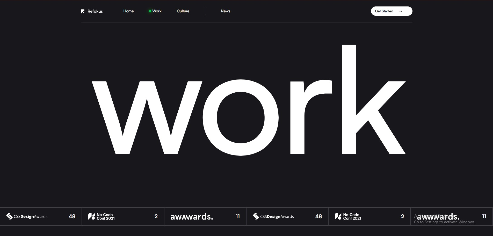

## 🚀 Refokus Website Clone

## 📌 Description:
A cool and smooth clone of the Refokus website built using React, Tailwind CSS, Framer Motion, and Locomotive Scroll. This project focuses on creating a seamless and immersive scrolling experience with beautiful animations.

## ✨ Features
✅ Smooth Scrolling with Locomotive Scroll
🎨 Stunning Animations powered by Framer Motion
⚡ Optimized Performance for a lag-free experience
🌎 Modern UI/UX inspired by Refokus

## 🛠️ Tech Stack
🖥️ Frontend: React, Vite
🎨 Styling: Tailwind CSS
🎬 Animations: Framer Motion
🌀 Smooth Scrolling: Locomotive Scroll

 📸 Preview

## 🚀 Live Demo

## 🔧 Installation & Setup

Clone the repository:

git clone https://github.com/Aadi-Si/refokus-clone.git
cd refokus-clone

Install dependencies:

npm install

Start the development server:

npm run dev

Your app should now be running at http://localhost:5173/ (if using Vite).

🔧 Deployment

To deploy your project on GitHub Pages, run:
npm run build
npm run deploy

## 🏗️ Project Structure
📂 refokus-clone
 ┣ 📂 src
 ┃ ┣ 📂 components  # Reusable UI Components
 ┃ ┣ 📂 pages       # Page Layouts
 ┃ ┣ 📂 assets      # Images, Fonts, etc.
 ┃ ┣ 📜 App.js      # Main App Component
 ┃ ┣ 📜 index.js    # Entry Point
 ┃ ┗ 📜 styles.css  # Global Styles
 ┣ 📜 package.json  # Dependencies & Scripts
 ┣ 📜 README.md     # Project Documentation
 ┗ 📜 tailwind.config.js  # Tailwind Config
🤝 Contributing
If you'd like to contribute, feel free to fork the repo and submit a pull request!

